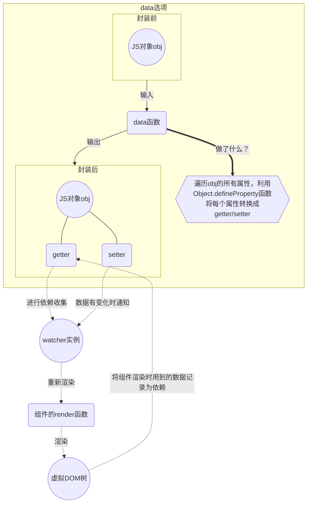

---
nav:
  title: Vue
  order: 2
group:
  title: vue特性
  order: 1
title: 响应式
order: 1
---


## 响应式基础

### 1、什么是响应式？

当用户在页面进行一些交互时，比如点击一个按钮进行查询，这样一个简单的动作，实际上需要先捕获到用户操作的DOM元素上对应的事件，在这个事件的具体实现中，会发起一个异步请求来获取后端返回的数据，然后将这个数据处理后再渲染到页面上。这一整套的流程，其实涉及两个数据流向，一是从HTML流向JS，另一个是从JS流向HTML。如果使用纯原生JS开发，则需要开发者自行实现对DOM元素的事件监听（HTML流向JS），以及将数据传递给DOM（JS流向HTML）。

纯原生开发的缺点是，开发者需要自行处理的事件监听太多，还要懂得什么时候将数据的变化更新到DOM上，并且还可能出现数据的频繁变化导致DOM渲染过于频繁而出现页面卡顿。

早期的JQuery框架，将开发者对DOM元素的捕获以及事件监听封装起来，提供了很多便捷的API，而现在流行的React、Vue、Angular等框架，则进一步弱化了开发者对DOM的处理，开发者可以专注于逻辑处理（JS的部分）。Vue这样的框架使得数据在更新后能适时地渲染到页面上，同时也简化了事件监听的处理，开发者无需再写一大堆addEventListener了。

响应式是Vue的主要特性之一，其作用概括来说，就是对数据进行劫持并收集相关依赖，在数据更新时能触发视图更新。


### 2、如何声明响应式数据

#### 2.1 Vue2.6

##### 声明响应式property

在组件的data函数返回的对象中，声明的property就是响应式数据，但是必须在初始化Vue实例之前就声明所有的根级响应式property。

```javascript
// 在组件的data函数中声明需要转换成响应式的属性
Vue.component('test-responsive', {
	data: function() {
		return {
			count: 0,
			message: '' // 即使是一个空字符串也必须提前声明
		}
	}
})
```

##### 声明计算属性computed

- 适用场景：一个数据的变化规则比较复杂，或者同时依赖于多个其他数据。

```javascript
Vue.component('test-computed', {
	data: function() {
		return {
			firstName: '',
            lastName: '',
		}
	},
    computed: {
        fullName: function() {
            // 这一段如果直接写到模板表达式中，会比较长
            return this.firstName + ' ' + this.lastName
        }
    }
})
```

- getter和setter：计算属性默认只有getter，但实际上还支持setter

```javascript
Vue.component('test-computed', {
	data: function() {
		return {
			firstName: '',
            lastName: '',
		}
	},
    computed: {
        fullName: {
            get: function() {
                return this.firstName + ' ' + this.lastName
            },
            set: function(nFirstName, nLastName) {
                // 注意：如果在这里尝试直接修改计算属性的值，会导致一个警告并且忽略setter中的修改，因为setter只用于修改计算属性的原始依赖
                this.firstName = nFirstName
                this.lastName = nLastName
            }
        }
    }
})
```

- 与methods的区别：computed计算属性是基于Vue的响应式依赖进行了缓存的，只有在相关的依赖发生变化时，计算属性才会重新求值；methods方法是每调用一次就会重新执行。


// 留个问题：vue2.6是如何实现computed的

##### 声明侦听属性watch

- 适用场景：适用于在数据变化时执行异步或者开销较大的操作。

```javascript
Vue.component('test-watch', {
	data: function() {
		return {
			question: '',
            answer: 'This is an empty question'
		}
	},
    watch: {
        question: function() {
            this.answer = 'Waiting for your input'
            this.getAnswer()
        }
    },
    methods: {
        getAnswer: function() {
            axios.get('https://test-watch/getanswer')
            	.then((res) => {
                this.answer = res.answer
            })
        }
    }
})
```

- computed与watch的区别：
  - 计算属性是基于依赖的数据进行计算得出一个新值并且具有缓存机制，侦听属性会在每次数据变化时执行指定的回调
  - 计算属性适用于需要根据其他数据来计算得出结果的情况，侦听属性适用于一些异步的或者开销较大的操作


#### 2.2 Vue3

##### 声明响应式状态

在Vue3中允许使用**选项式API**或者**组合式API**两种编码风格来书写组件。

**选项式API**

与Vue2.6的声明方式一致。

- 使用data选项来声明
- data选项是一个函数，函数中必须返回一个对象
- Vue在创建组件实例时会调用此函数，并且将该函数返回的对象用响应式系统进行包装
- 这个对象的所有顶层属性都会被代理到组件实例上（在组件中用this可以访问到这些顶层属性）

```javascript
export default {
    data() {
        return {
            count: 0,
            message: ''
        };
    }
}
```

**组合式API**

组合式API的方式提供了两个API来声明响应式数据，一个是ref()，一个是reactive()。

**reactive()**

- 仅仅用于声明引用类型的声明（响应式对象、数组、set、map等）
- 响应式对象本质是一个Proxy
- 为了在模板中可以使用响应式状态，需要在setup函数中定义并返回，或者使用<script setup>
- 有2个局限性
  - 只对对象类型有效，对原始类型无效
  - 只能保持对初始引用对象的响应追踪（如果对响应式对象进行重新赋值，会导致原始的响应式对象失去追踪）

```javascript
import { reactive } from "vue";

export default {
    setup() {
        const state = reactive({ count: 0 });
        return {
            state // 暴露state到模板
        }
    }
}
```

```vue
// 或者
<script setup>
import { reactive } from "vue";

const state = reactive({ count: 0 });
</script>
```

**ref()**

- 可用于创建任意类型的响应式数据
- ref()函数将传入的任意值包装为一个带.value属性的ref对象
- ref创建的响应式对象不会丢失响应性（被解构，被传递时）

```javascript
import { ref } from 'vue'

const count = ref(0) // 等价于 ref({ value: 0 })
```

或者

```javascript
import { ref } from 'vue'

const count = ref({ count: 0})
```

**ref()与reactive()的区别总结**

- 


##### 对比和总结

<table>
    <thead>
        <tr>
            <th></th>
            <th>选项式API</th>
            <th colSpan="2">组合式API</th>
        </tr>
    </thead>
    <tbody>
        <tr>
            <td>实现原理</td>
            <td>getter/setter</td>
            <td>Proxy</td>
            <td>getter/setter</td>
        </tr>
        <tr>
            <td>声明响应式对象</td>
            <td>data()函数</td>
            <td>reactive()函数</td>
            <td>ref()函数</td>
        </tr>
        <tr>
            <td>
                解构响应式对象<br />
                （将对象属性结构为局部变量，对局部变量是否仍具有响应性）
            </td>
            <td>
                局部变量失去响应性<br />
                （因为对局部变量的访问不会触发getter/setter）
            </td>
            <td></td>
            <td></td>
        </tr>
    </tbody>
</table>


### 3、DOM更新


## 响应式原理

从实现原理上来深入理解Vue响应式系统的。

### 1、vue2中的响应式原理

#### 建立依赖-追踪变化-响应变化


#### 总结


### 2、vue3中的实现原理

### 响应式代理 vs. 原始对象


如何实现依赖跟踪





## 总结和对比


